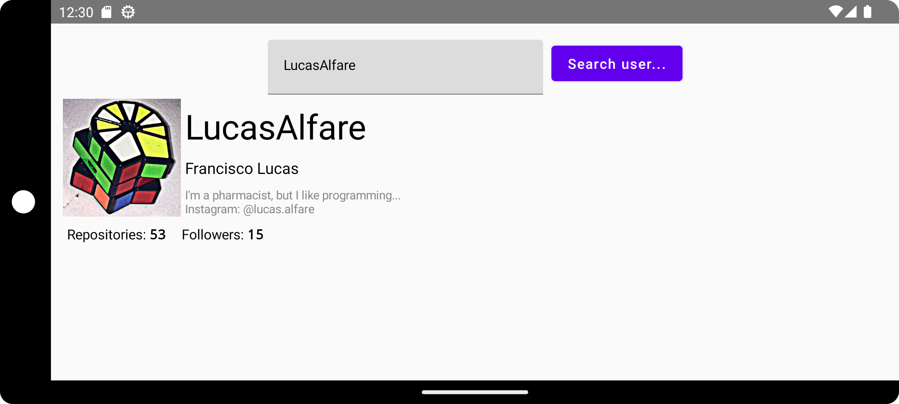
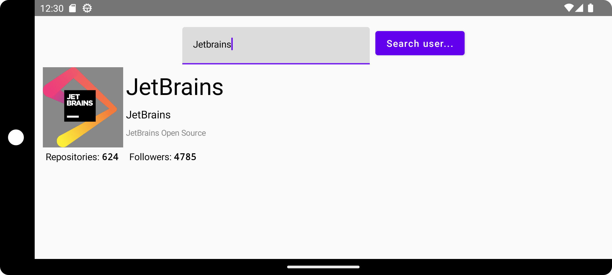

# FLConsumer

This is my own experiment in creating an application to consume an external API. In this example, was chosen the GitHub API itself, where we take data from it and populate a basic User Interface with that information.

Also, at this point, this application example, works by providing basic information about GitHub users. This is achieved by entenring the GitHub login name of the user and, if it exists, the basic information is shown below the input form.

# Implementation helpers

This example was made in order to use:

- [`Ktor`](https://ktor.io/) dependencies as the main client provider;
- [`gson`](https://github.com/google/gson) to parse the JSON responses;
- My own custom event listening library [`FLListening`](https://github.com/LucasAlfare/FLListening) to help decouple UI from backend/model management.

All of those implementations versions can be detailed reviewed in the [build.gradle.kts](https://github.com/LucasAlfare/FLConsumer/blob/master/android/build.gradle.kts#L9) file.

# Android Emulator Screenshots

- Seraching for `LucasAlfare` user:

- Seraching for `JetBrains` user:

# [License](https://github.com/LucasAlfare/FLConsumer/blob/master/LICENSE)
